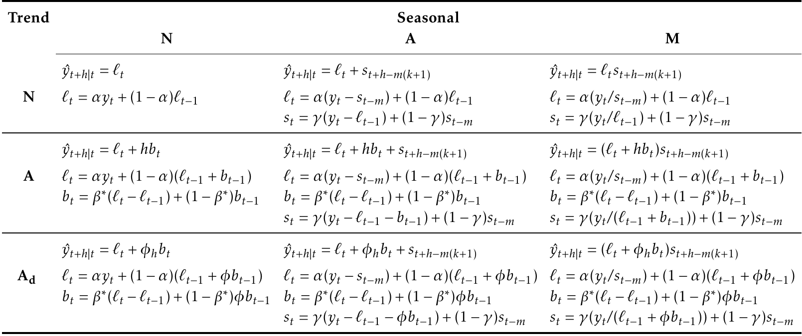

Table: (\#tab:pegels) Formulas for recursive calculations and point forecasts. In each case, $\ell_t$ denotes the series level at time $t$, $b_t$ denotes the slope at time $t$, $s_t$ denotes the seasonal component of the series at time $t$, and $m$ denotes the number of seasons in a year; $\alpha$, $\beta^*$, $\gamma$ and $\phi$ are smoothing parameters, $\phi_h = \phi+\phi^2+\dots+\phi^{h}$, and $k$ is the integer part of $(h-1)/m$.

-------------------------------------------
```{r pegelstable, echo=FALSE}

```
-------------------------------------------
